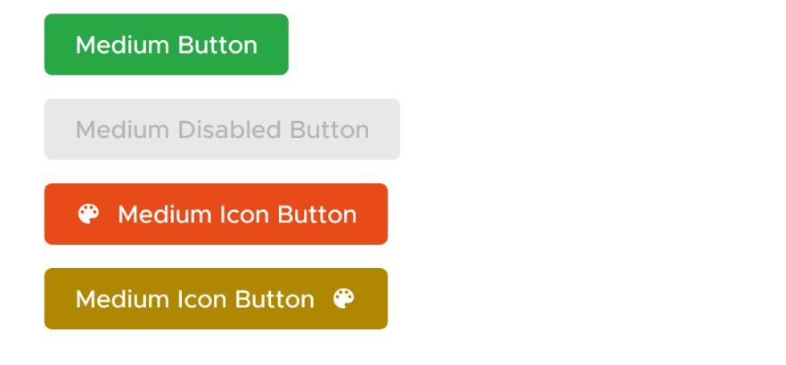

# SushiButton


A view that allows users to tap to trigger an action. `SushiButton` is fully based on
[MaterialButton](https://material.io/develop/android/components/material-button/)

## Features

SushiButton comes with following properties

| Attribute            | Value                                                           |
| -------------------- | --------------------------------------------------------------- |
| app:buttonDimensions | `large`, `medium` or `small`                                    |
| app:buttonType       | `solid`, `outline` or `text`                                    |
| app:buttonColor      | And @color/ attribute that we use to theme the button           |
| app:drawableLeft     | `@drawable` or `@string` which is treated as iconfont character |
| app:drawableRight    | `@drawable` or `@string` which is treated as iconfont character |
| app:drawableStart    | `@drawable` or `@string` which is treated as iconfont character |
| app:drawableEnd      | `@drawable` or `@string` which is treated as iconfont character |

<DrawableWarning/>

### Unsupported Properties

Do not set `textSize`, `textColor` and `background` manually. Rely only on above
properties to set a proper button theme for you.

Setting unsupported properties _may_ throw **UnsupportedException** in future

## Usage

### Creating in XML

```xml
  <com.zomato.sushilib.atoms.buttons.SushiButton
      app:buttonType="solid"
      app:buttonDimensions="large"
      android:layout_width="match_parent"
      android:layout_height="wrap_content"
      android:text="Large Button" />

```

### Changing Properties Programatically

```kotlin
sushiButton.setButtonType(ButtonType.SOLID)
sushiButton.setButtonDimension(ButtonDimension.LARGE)
```

## Examples

### Types

You can set button type using either XML in layouts, or programatically in Java/Kotlin

#### Solid


#### Outline


#### Text


### Dimensions

:::tip INFO
Some libraries (including Google's GMS) use `buttonSize` as an attribute
that accepts `@dimen` type values. So as to not conflict with that attribute,
we use the attribute `buttonDimension`. Do not set size, padding and font size
on your own, and use one of the preset `buttonDimension` values only.
:::

#### Large


#### Medium


#### Small


### Colors

We support using any color (we set the text color, the disabled state tint lists accordingly).


