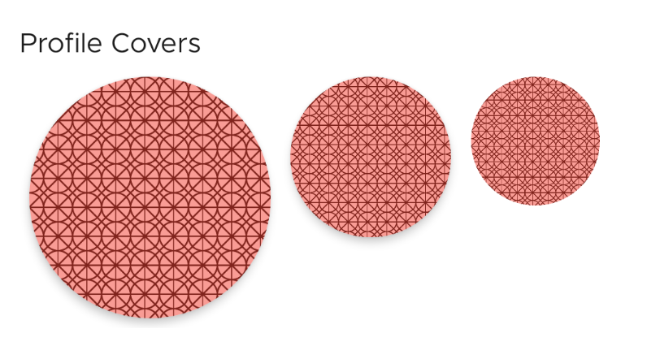
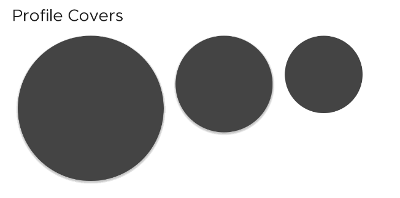

# SushiCircleImageView



<figcaption align="center">
<small>Different sizes. Last one without elevation</small>
</figcaption>

An imageview that shows an image as a circle.
Extends from [AppCompatImageView](https://developer.android.com/reference/android/support/v7/widget/AppCompatImageView)
and hence is fully compatible with most image loaders like Glide, Picasso

## Usage

:::warning WARNING: SCALETYPE
`SushiCircleImageView` supports only `ScaleType.CENTER_CROP`. Setting anything else either via XML
or Java/Kotlin will **have no effect**
:::

### Create in XML

```xml
<com.zomato.sushilib.atoms.imageviews.SushiCircleImageView
    android:layout_width="150dp"
    android:layout_height="150dp"
    android:layout_margin="@dimen/sushi_spacing_mini"
    android:elevation="@dimen/sushi_spacing_micro"
    android:scaleType="centerCrop"
    android:src="@drawable/bg_sample1" />
```

## Preview

:::danger A NOTE ABOUT PREVIEWS
Previews in Android Studio show the shape, but not the src/drawable. It will only show a grey fill.
This is done for performance reasons, as during runtime we do not run our own `onDraw` code, and instead
simply set an `ViewOutlineProvider`. Only for preview we draw the shape, as a placeholder.
:::



<figcaption align="center">Preview in Android Studio</figcaption>
