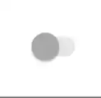

# SushiSwitch

<p align="center">

</p>

A form component that can be toggled between on/off states. Based on [SwitchCompat](https://developer.android.com/reference/android/support/v7/widget/SwitchCompat)

## Features

Supports all features of [SwitchCompat](https://developer.android.com/reference/android/support/v7/widget/SwitchCompat)

Additional attributes -

| Attribute        | Value                                                   |
| ---------------- | ------------------------------------------------------- |
| app:controlColor | A `@color` uses to tint and shade enabled/checked state |

## Usage

### Create in XML

```xml
<com.zomato.sushilib.molecules.inputfields.SushiSwitch
    android:layout_width="wrap_content"
    android:layout_height="wrap_content"
    android:layout_gravity="center"
    app:controlColor="@color/sushi_green_500" />
```

### Functionality in Java/Kotlin

Apart from default functionality, you can change control color

```kotlin
switchBtn.isChecked = true
switchBtn.controlColor = Color.RED
```

## Examples


