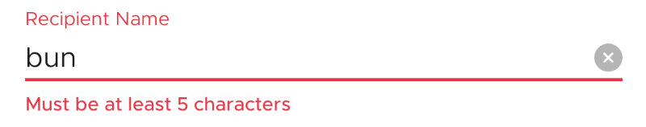
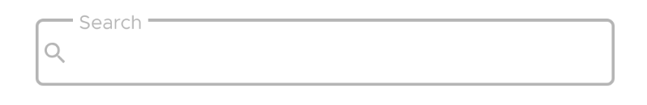

# SushiTextInputField



Text input fields allow users to enter and edit text. It is not directly an `EditText`, but an
extension of [TextInputLayout](https://material.io/develop/android/components/text-input-layout/) from Material Components. It contains an [TextInputEditText](https://developer.android.com/reference/android/support/design/widget/TextInputEditText) inside, which is exposed as `editText`

## Features

All XML attributes of Material `TextInputLayout`, like `errorEnabled` are supported. Also most
attributes of `EditText` like `hint`, `inputType` are proxied into the internal EditText

| Attribute         | Value                                                                                 |
| ----------------- | ------------------------------------------------------------------------------------- |
| style             | `@style/Widget.Sushi.TextInputField` or `@style/Widget.Sushi.TextInputField.Outlined` |
| app:drawableLeft  | `@drawable` or `@string` which is treated as iconfont character                       |
| app:drawableRight | `@drawable` or `@string` which is treated as iconfont character                       |
| app:drawableStart | `@drawable` or `@string` which is treated as iconfont character                       |
| app:drawableEnd   | `@drawable` or `@string` which is treated as iconfont character                       |
| android:hint      | The hint inside the internal EditText                                                 |
| android:inputType | The input type, for eg. `text` `textPassword`, `date`, `number`                       |

<DrawableWarning/>

## Usage

### Creating in XML

You can set `drawableRight` or `drawableLeft`, either as `@drawable` or a `@string` which is
font icon character

```xml
<com.zomato.sushilib.molecules.inputfields.SushiTextInputField
    android:id="@+id/textFieldRecipient"
    style="@style/Widget.Sushi.TextInputField"
    android:layout_width="match_parent"
    android:layout_height="wrap_content"
    android:hint="Recipient Name"
    app:drawableEnd="@string/icon_cross_filled"
    app:errorEnabled="true" />
```

### Functionality via Java/Kotlin

Via `setEdgeDrawableClickListener` you can decide what happens
when the `drawableStart` (left) or `drawableEnd` (right) is clicked

```kotlin
textFieldRecipient.setEdgeDrawableClickListener(
    object : SushiTextInputField.EdgeDrawableClickListener {
        override fun onDrawableStartClicked() {}

        override fun onDrawableEndClicked() {
            rootView.textFieldRecipient.editText?.setText("")
        }

    })
```

You can also use `setTextValidator` to add a validation function that takes
the current text and returns an error (or `null`, if no error). The validator is called
every time text changes.

```kotlin
textFieldRecipient.setTextValidator { text ->
    "Must be at least 5 characters".takeIf {
        TextUtils.isEmpty(text) || TextUtils.getTrimmedLength(text) < 5
    }
}
```

## Examples

### Drawable (Clear Button)


### Error Handling


### Outlined (for Searchbox)


