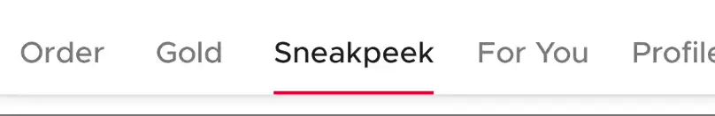

# SushiTabLayout



A set of tabs, usually used for switching between panes (fragments/viewpager). Based on Design Support Library's [TabLayout](https://developer.android.com/reference/android/support/design/widget/TabLayout)

## Features

Supports all features from [TabLayout](https://developer.android.com/reference/android/support/design/widget/TabLayout)

## Usage

### Create in XML

You can create the entire tab layout statically in XML

```xml
<com.zomato.sushilib.organisms.navigation.SushiTabLayout
    android:id="@+id/tabs"
    android:elevation="@dimen/sushi_spacing_mini"
    android:layout_width="match_parent"
    android:layout_height="wrap_content">

    <android.support.design.widget.TabItem
        android:layout_width="wrap_content"
        android:layout_height="wrap_content"
        android:text="Order" />

    <android.support.design.widget.TabItem
        android:layout_width="wrap_content"
        android:layout_height="wrap_content"
        android:text="Gold" />

    <android.support.design.widget.TabItem
        android:layout_width="wrap_content"
        android:layout_height="wrap_content"
        android:text="Sneakpeek" />

    <android.support.design.widget.TabItem
        android:layout_width="wrap_content"
        android:layout_height="wrap_content"
        android:text="For You" />

    <android.support.design.widget.TabItem
        android:layout_width="wrap_content"
        android:layout_height="wrap_content"
        android:text="Profile" />

    <android.support.design.widget.TabItem
        android:layout_width="wrap_content"
        android:layout_height="wrap_content"
        android:text="Discover" />

</com.zomato.sushilib.organisms.navigation.SushiTabLayout>
```

### Functionality in Java/Kotlin

You can add tabs programatically too

```kotlin
tabLayout.addTab(TabLayout.Tab().apply {
    text = "Item"
})
```
